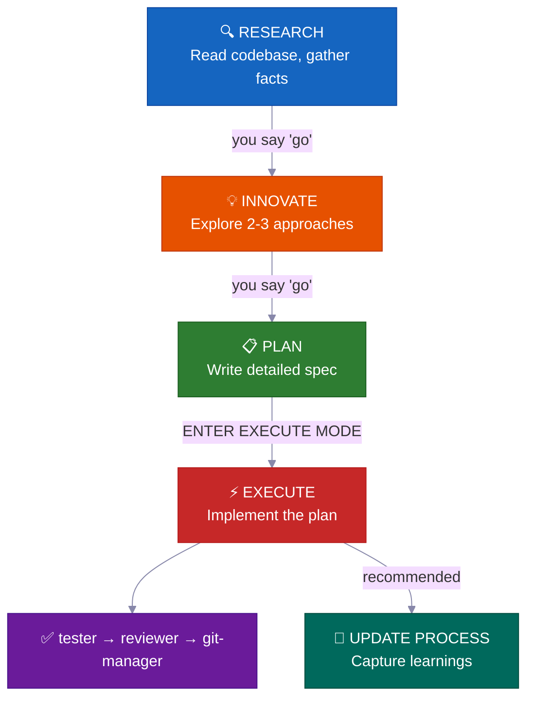
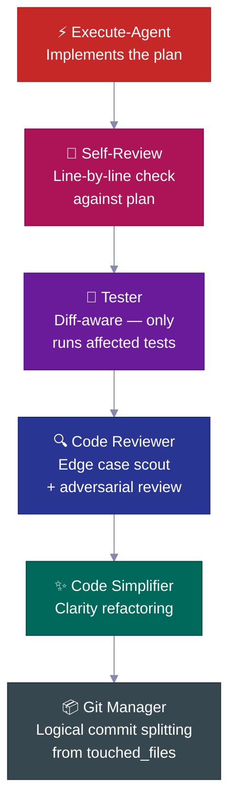
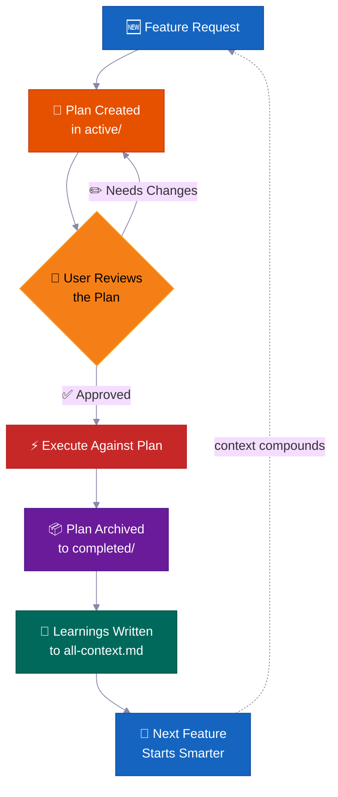
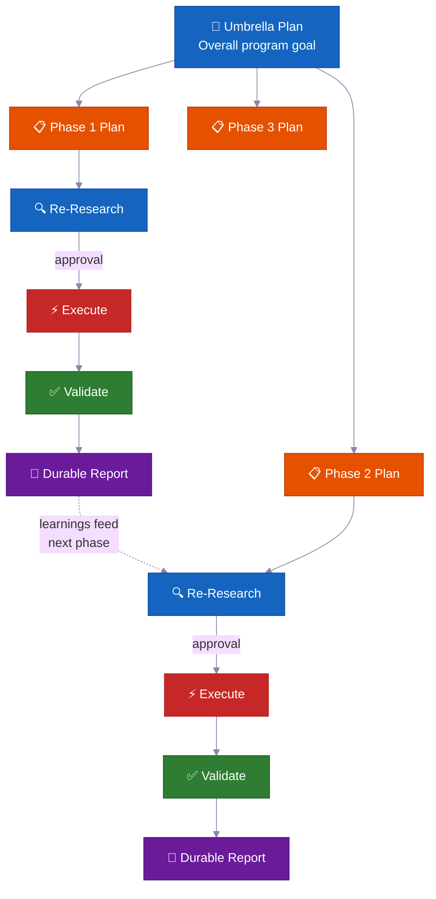

<p align="center">
  <a href="../../README.md">English</a> |
  <a href="README.zh-CN.md">简体中文</a> |
  <a href="README.ja-JP.md">日本語</a> |
  <a href="README.ko-KR.md">한국어</a> |
  <a href="README.vi-VN.md">Tiếng Việt</a> |
  <a href="README.pt-BR.md">Português</a> |
  <a href="README.es.md">Español</a> |
  <strong>Deutsch</strong> |
  <a href="README.fr.md">Français</a> |
  <a href="README.hi.md">हिंदी</a>
</p>

<div align="center">

<a href="https://flowser.ai">
  
</a>

*Entwickelt von Weltklasse-Ingenieuren, für Vibecoders bei*<br>
*[flowser.ai](https://flowser.ai) — KI-Agenten mit Computern für GTM*

<br>

# vibecode-pro-max-kit

**Stoppe deine KI davon, zu coden bevor sie denkt — und vergiss nie wieder deine detaillierten Prompts.<br>Dieses Harness verwandelt jeden KI-Coding-Agenten in ein spec-getriebenes Engineering-Team,<br>das recherchiert, plant, produktionsreifen Code liefert und sein Gedächtnis selbst verbessert — robust gegen Context-Rot, selbst nach 6 Monaten.**

<br>

<p align="center">
  
  <br><br>
  <em>"Totale Konzentration — Spec-Atmung, Zehnte Form: Der Vibe Flow bricht niemals ab."</em><br>
  <strong>— Tanjiro Kamado</strong>
</p>

🔬 Spec-getriebene Entwicklung für KI-Agenten<br>
📋 Generiert automatisch PRDs, verwaltet Backlogs, leitet Kontext automatisch weiter<br>
🧠 Selbst verbessernde Wissensbasis, die sich mit jeder Lieferung aufbaut<br>
⚡ Läuft stundenlang autonom bei großen Aufgaben ohne Zustandsverlust<br>
🤝 Pläne und Specs sind teilbar — Entwickler, PMs und Stakeholder prüfen dieselben Artefakte

<p>
  <a href="https://github.com/withkynam/vibecode-pro-max-kit/stargazers"></a>
  <a href="https://github.com/withkynam/vibecode-pro-max-kit/network/members"></a>
  <a href="LICENSE"></a>
  <a href="https://github.com/withkynam/vibecode-pro-max-kit/graphs/contributors"></a>
  <a href="https://github.com/withkynam/vibecode-pro-max-kit/actions/workflows/validate.yml"></a>
  <a href="https://github.com/withkynam/vibecode-pro-max-kit/commits/main"></a>
  
  
  
</p>

<p>
  <strong>Das einfachste, flexibelste und teamfreundlichste Coding-Harness für</strong><br><br>
  <a href="https://github.com/anthropics/claude-code"></a>&nbsp;
  <a href="https://github.com/openai/codex"></a>&nbsp;
  <a href="https://cursor.com"></a>&nbsp;
  <a href="https://windsurf.com"></a><br>
  <a href="https://github.com/google-gemini/gemini-cli"></a>&nbsp;
  <a href="https://github.com/opencode-ai/opencode"></a>&nbsp;
  <a href="https://github.com/features/copilot"></a>
</p>

<p>
  <em>Funktioniert mit jedem Tech-Stack, jeder Sprache, jedem Projekt</em><br><br>
  <picture>
    <source media="(prefers-color-scheme: dark)" srcset="https://skillicons.dev/icons?i=ts%2Cjs%2Creact%2Cnextjs%2Cvue%2Cnuxt%2Csvelte%2Cangular%2Cnodejs%2Cexpress%2Cbun%2Cpython%2Cdjango%2Cflask%2Cfastapi&theme=dark&perline=15" />
    <source media="(prefers-color-scheme: light)" srcset="https://skillicons.dev/icons?i=ts%2Cjs%2Creact%2Cnextjs%2Cvue%2Cnuxt%2Csvelte%2Cangular%2Cnodejs%2Cexpress%2Cbun%2Cpython%2Cdjango%2Cflask%2Cfastapi&theme=light&perline=15" />
    
  </picture>
  <br>
  <picture>
    <source media="(prefers-color-scheme: dark)" srcset="https://skillicons.dev/icons?i=ruby%2Crails%2Cgo%2Crust%2Cjava%2Cspring%2Ckotlin%2Cswift%2Cphp%2Claravel%2Ccs%2Cdotnet%2Celixir%2Cgraphql%2Cprisma&theme=dark&perline=15" />
    <source media="(prefers-color-scheme: light)" srcset="https://skillicons.dev/icons?i=ruby%2Crails%2Cgo%2Crust%2Cjava%2Cspring%2Ckotlin%2Cswift%2Cphp%2Claravel%2Ccs%2Cdotnet%2Celixir%2Cgraphql%2Cprisma&theme=light&perline=15" />
    
  </picture>
  <br>
  <picture>
    <source media="(prefers-color-scheme: dark)" srcset="https://skillicons.dev/icons?i=supabase%2Cfirebase%2Cpostgres%2Cmongodb%2Credis%2Cdocker%2Ckubernetes%2Caws%2Cgcp%2Cazure%2Cvercel%2Ccloudflare%2Ctailwind%2Celectron&theme=dark&perline=15" />
    <source media="(prefers-color-scheme: light)" srcset="https://skillicons.dev/icons?i=supabase%2Cfirebase%2Cpostgres%2Cmongodb%2Credis%2Cdocker%2Ckubernetes%2Caws%2Cgcp%2Cazure%2Cvercel%2Ccloudflare%2Ctailwind%2Celectron&theme=light&perline=15" />
    
  </picture>
  <br>
  <p><em>Nicht nur zur Dekoration. Wenn du <code>vc-setup</code> ausführst, scannen parallele Agenten deine Codebasis,<br>
  erkennen deinen Stack und erstellen projektspezifische Context Groups, die jede Skill vor ihrer Arbeit liest.<br>
  Andere Harnesses binden Agenten an eine Sprache — <code>rust-review-agent</code>, <code>python-linter</code> — nutzlos anderswo.<br>
  Dieses passt sich jeder Kombination oben an und sammelt Wissen mit jedem Deployment.</em></p>
</p>

</div>

---

## 🚀 Installation (30 Sekunden)

> **Führe dies in deinem Projektordner aus.** Öffne ein Terminal und wechsle mit `cd` in das Projekt, in das das Harness installiert werden soll, *bevor* du den Befehl ausführst — es wird in das aktuelle Verzeichnis installiert.
>
> Lieber vom Agenten aus steuern? Öffne Claude Code oder Codex **mit diesem Projektordner als Arbeitsverzeichnis** und füge dann den [vollständigen Setup-Prompt](#-full-agent-setup-prompt) unten ein.

```bash
curl -fsSL https://raw.githubusercontent.com/withkynam/vibecode-pro-max-kit/main/install.sh | bash
```

Öffne dann Claude Code und sage:

```
Run vc-setup
```

Das war's. Der Setup-Skill erkennt deinen Stack, fragt dich nach deinem Projekt (ein echtes Gespräch, keine Checkliste), erstellt das Process-Verzeichnis, scannt deine Codebasis tiefgründig und befüllt Context-Dateien mit echtem Inhalt — keine Platzhalter.

<br>

<details>
<summary><strong>📦 Was wird installiert</strong></summary>

<br>

```
your-project/
├── .claude/
│   ├── agents/              # 🤖 12 spezialisierte Agenten-Definitionen
│   │   ├── vc-research-agent.md
│   │   ├── vc-execute-agent.md
│   │   └── ...
│   ├── skills/              # ⚡ 31 automatisch erkannte Skills
│   │   ├── vc-generate-plan/
│   │   ├── vc-security/
│   │   ├── vc-scout/
│   │   └── ...
│   └── hooks/               # 🪝 7 Lifecycle-Hooks
│       ├── privacy-block.cjs
│       ├── scout-block.cjs
│       └── ...
├── .codex/
│   └── agents/              # 🔄 Gespiegelte Agenten für Codex
├── CLAUDE.md                # 📋 Orchestrator + Routing-Regeln
├── AGENTS.md                # 📖 Agenten-Registry
└── process/                 # 🧠 Erstellt von vc-setup (nicht install)
    └── ...
```

- **Neues Projekt?** Installiert das vollständige Harness, dann studiert `vc-setup` deine Codebasis
- **Vorhandene `.claude/`-Konfiguration?** Wird in `.vibecode-backup/` gesichert, Harness neu installiert, deine `settings.json` wiederhergestellt
- **Vorhandenes `process/`-Verzeichnis?** Wird von install nie angetastet — `vc-setup` übernimmt die Migration intelligent
- **Vorhandene `CLAUDE.md`?** Wird als `CLAUDE.md.pre-vibecode` gesichert, Harness-Version installiert

</details>

<a id="-full-agent-setup-prompt"></a>

<details>
<summary><strong>🤖 Vollständiger Agenten-Setup-Prompt</strong> (kopiere dies in Claude Code für maximale Kontrolle)</summary>

> **Öffne zunächst Claude Code oder Codex mit deinem Projektordner als Arbeitsverzeichnis** (starte es von innerhalb des Projekts oder wechsle erst dorthin mit `cd`). Das Harness wird in das aktuelle Verzeichnis installiert, also muss dies dein Projekt sein — dann füge den Prompt unten ein.

```
First, install the vibecode-pro-max-kit agent harness by running this command:

curl -fsSL https://raw.githubusercontent.com/withkynam/vibecode-pro-max-kit/main/install.sh | bash

After the install completes, run vc-setup to configure everything for this project.

Follow the full interactive flow:

1. DETECT — Read package.json, detect my stack (framework, package manager, monorepo
   structure, test framework, database, auth). Also check if I have any existing .claude/,
   process/, or context files from a previous setup.

2. SHOW ME WHAT YOU FOUND — Present a summary of the detection results and wait for me
   to confirm before continuing. If this is an existing project with process/ folders or
   context files, tell me what you found and what looks good vs what could be improved.

3. ASK ME ABOUT THE PROJECT — Before scaffolding or scanning, have a real conversation
   with me about this project. Don't just ask a fixed list of questions and move on — ask
   follow-ups based on my answers, probe deeper on anything vague, and keep going until
   you genuinely understand the project. Start with the basics (what is this? who uses it?),
   then dig into architecture, features, conventions, pain points, and anything else that
   matters. Summarize your understanding back to me and confirm it's correct before moving on.

4. SCAFFOLD — Create the process/ directory structure. If I already have process/ folders,
   show me what you plan to change and wait for my approval before reorganizing anything.
   Never silently move or delete my existing files.

5. STUDY — Deep-scan the codebase and populate process/context/all-context.md with REAL
   content based on what you find AND what I told you. Include: repo structure, tech stack
   with versions, key patterns and conventions, import aliases, env vars, API routes,
   database schema, test setup. Do not leave placeholder text.

6. VALIDATE — Run all the validation checks to make sure everything is wired correctly.

Important rules:
- If I have existing context files or a well-written CLAUDE.md, read them first and
  preserve what is good. Merge intelligently — do not replace good content with generic scans.
- Show me a summary of what you plan to create or change at each major step and wait
  for my OK before proceeding.
- Do not create empty placeholder files. Only create files that have real content.
- Ask before reorganizing. If my existing setup works, tell me what you would improve
  and let me decide.
```

</details>

<br>

<details>
<summary>Inhaltsverzeichnis</summary>

- [Das Problem](#-das-problem)
- [Die Lösung](#-die-lösung)
- [Die Vibe-Coding-Revolution](#die-vibe-coding-revolution)
- [Für wen ist das gedacht?](#für-wen-ist-das-gedacht)
- [Auf einen Blick](#auf-einen-blick)
- [Warum Teams das nutzen](#-warum-teams-das-nutzen)
- [Vergleich](#vergleich)
- [Was macht das besonders](#-was-macht-das-besonders)
- [Was ist enthalten](#-was-ist-enthalten)
- [Wie es funktioniert](#-wie-es-funktioniert)
- [Eingebaute Sicherheitssysteme](#-eingebaute-sicherheitssysteme)
- [Mitwirken](#mitwirken)
- [Star-Verlauf](#-star-verlauf)

</details>

---

## 🔥 Das Problem

Du bittest Claude, „Webhook-Unterstützung hinzuzufügen." Es fängt sofort an, Code zu schreiben. Keine Fragen zu deiner Architektur. Kein Blick auf bestehende Muster. Kein Plan. Du bekommst 400 Zeilen, die nicht zu deiner Codebasis passen, und verbringst eine Stunde damit, sie zu korrigieren.

**Aber das ist nur die Oberfläche.** Die tieferen Probleme treffen härter:

<table>
<tr>
<td width="50%" valign="top">
<h1>🧠</h1>
<strong>Kontext stirbt nach jeder Sitzung</strong><br><br>
Dein Agent vergisst alles, was er gelernt hat. Dieselben Fehler, dieselben Fragen, jedes Mal. Kein Gedächtnis, kein sich aufbauendes Wissen.
</td>
<td width="50%" valign="top">
<h1>📄</h1>
<strong>Docs veralten sofort</strong><br><br>
Du hast letzte Woche großartige Kontext-Docs geschrieben. Die sind schon wieder veraltet. Nichts aktualisiert sie automatisch, wenn sich die Codebasis weiterentwickelt.
</td>
</tr>
<tr>
<td width="50%" valign="top">
<h1>💥</h1>
<strong>Große Aufgaben kollabieren auf halbem Weg</strong><br><br>
Das Context-Fenster füllt sich, der Zustand geht verloren, der Agent beginnt zu halluzinieren. In Stunde 3 fängst du von vorne an.
</td>
<td width="50%" valign="top">
<h1>🤝</h1>
<strong>Keine Specs, kein Review, keine Zusammenarbeit</strong><br><br>
Dein PM kann nicht prüfen, was der Agent gleich bauen wird. Es gibt kein Artefakt, das man teilen, besprechen oder genehmigen kann, bevor Code geschrieben wird.
</td>
</tr>
<tr>
<td width="50%" valign="top">
<h1>🎭</h1>
<strong>Architekturentscheidungen werden halluziniert</strong><br><br>
Der Agent erfindet Muster, anstatt zu recherchieren, wie andere Codebasen dasselbe Problem gelöst haben.
</td>
</tr>
</table>

**Dein Agent hat Intelligenz, aber keinen Prozess, kein Gedächtnis und keine Möglichkeit, mit deinem Team zusammenzuarbeiten.**

Ob Entwickler, PM oder CEO, der gerade mit Vibe Coding anfängt — dieses Problem trifft jeden gleich. Die Lösung ist auch dieselbe: **Gib deinem Agenten einen echten Entwicklungsprozess.**

---

## 🛠️ Die Lösung

Dieses Harness installiert ein vollständiges Entwicklungssystem in dein Projekt — nicht nur eine CLAUDE.md-Datei, sondern **12 spezialisierte Agenten, 31 Skills** und einen phasengesperrten Workflow, der deinen Agenten zwingt, **zu verstehen, bevor er baut**.

<br>

<table>
<tr>
<td align="center" width="50%" valign="top">
<h1>📋</h1>
<strong>Spec-getriebene Pläne</strong><br><br>
<sub>PMs und Entwickler prüfen dasselbe Plan-Artefakt, bevor eine einzige Zeile Code geschrieben wird</sub>
</td>
<td align="center" width="50%" valign="top">
<h1>🔄</h1>
<strong>Selbst verbessernder Kontext</strong><br><br>
<sub>Aktualisiert sich automatisch, wenn ein Feature fertig ist — Docs veralten nie</sub>
</td>
</tr>
<tr>
<td align="center" width="50%" valign="top">
<h1>⚡</h1>
<strong>Autonome Ausführung</strong><br><br>
<sub>Übersteht Context-Komprimierung — läuft stundenlang, nicht minutenlang</sub>
</td>
<td align="center" width="50%" valign="top">
<h1>🧬</h1>
<strong>Architektur-Recherche</strong><br><br>
<sub>Studiert echte Codebasen, bevor Designentscheidungen getroffen werden</sub>
</td>
</tr>
<tr>
<td align="center" width="50%" valign="top">
<h1>🧭</h1>
<strong>Intelligentes Context-Routing</strong><br><br>
<sub>Lädt nur das Relevante — nicht jedes Mal deine gesamte Wissensbasis</sub>
</td>
</tr>
</table>

<br>



Jeder Übergang erfordert deine **ausdrückliche Genehmigung**. Nichts geht automatisch weiter. Du behältst die Kontrolle.

---

## Die Vibe-Coding-Revolution

<div align="center">
<h3><em>"Die heißeste neue Programmiersprache ist Englisch."</em></h3>
<strong>— Andrej Karpathy</strong>
</div>

<br>

**Vibe Coding hat verändert, wer Software bauen kann. Spec-getriebene Entwicklung verändert, was sie liefern können.**

<table>
<tr>
<td align="center" width="50%">
<h3>63%</h3>
<sub>der Vibe-Coding-Nutzer sind <strong>KEINE</strong> Entwickler</sub>
</td>
<td align="center" width="50%">
<h3>16,2 Mio.</h3>
<sub>Citizen Developer weltweit<br>(38% jährliches Wachstum)</sub>
</td>
</tr>
<tr>
<td align="center" width="50%">
<h3>4,7 Mrd. $</h3>
<sub>Vibe-Coding-Markt<br>wächst jährlich um 38%</sub>
</td>
<td align="center" width="50%">
<h3>25%</h3>
<sub>der YC-W25-Startups hatten Codebasen mit über 95% KI-generiertem Code</sub>
</td>
</tr>
</table>

Die meisten Tools helfen dir, ein Projekt zu starten. Dieses Harness hilft dir, es **fertigzustellen** — mit Plänen, die dein Team prüfen kann, Kontext, der nie veraltet, und Sicherheitssystemen, die Fehler abfangen, bevor sie ausgeliefert werden.

---

## Für wen ist das gedacht?

<div align="center">
<h3><em>"Es kommt nicht darauf an, wer es getippt hat. Sondern was geliefert wurde."</em></h3>
<strong>— Garry Tan, YC</strong>
</div>

<br>

Ob du gerade Vibe Coding entdeckt hast oder ein Staff Engineer bist, der Produktionssysteme ausliefert — dieses Harness passt sich deinem Workflow an.

<table>
<tr>
<td width="50%" valign="top">
<h1>🧑‍💼</h1>
<strong>CEO / Gründer</strong><br><br>
<em>„Bau mir ein SaaS mit Auth, Billing und einer Landing Page"</em><br><br>
Der Agent recherchiert deinen Stack, schreibt einen Architekturplan zur Prüfung, implementiert mit Tests und dokumentiert jede Entscheidung für deinen technischen Mitgründer zur späteren Überprüfung.
</td>
<td width="50%" valign="top">
<h1>📊</h1>
<strong>Product Manager</strong><br><br>
<em>„Erstelle ein Dashboard mit MRR, Churn und Wachstums-Metriken"</em><br><br>
Es generiert eine PRD-artige Spec, holt deine Genehmigung vor dem Coden ein, implementiert nach Spec und archiviert den Plan als durchsuchbare Projekthistorie.
</td>
</tr>
<tr>
<td width="50%" valign="top">
<h1>🎨</h1>
<strong>Designer</strong><br><br>
<em>„Passe diesen Figma-Screenshot pixelgenau an"</em><br><br>
Der design-bewusste Agent analysiert deinen Mockup, implementiert Komponente für Komponente mit deinen Design-Tokens und startet visuelle Vergleichsprüfungen.
</td>
<td width="50%" valign="top">
<h1>⚙️</h1>
<strong>Ingenieur</strong><br><br>
<em>„Refaktoriere das Auth-Modul für RBAC-Unterstützung ohne Ausfallzeit"</em><br><br>
Es recherchiert deinen aktuellen Auth-Code und wie andere Codebasen RBAC gelöst haben, schreibt einen Migrationsplan mit Blast-Radius-Analyse, implementiert sicher mit Rollback-Hinweisen.
</td>
</tr>
</table>

---

## Auf einen Blick

<table>
<tr>
<td align="center" width="50%" valign="top">
<h1>🤖</h1>
<h3>12</h3>
<strong>Spezialisierte Agenten</strong><br>
<sub>Fachexperten, die jede Entwicklungsphase verantworten</sub>
</td>
<td align="center" width="50%" valign="top">
<h1>⚡</h1>
<h3>32</h3>
<strong>Automatisch erkannte Skills</strong><br>
<sub>Wiederverwendbare Fähigkeiten durch Keyword-Matching gefunden</sub>
</td>
</tr>
<tr>
<td align="center" width="50%" valign="top">
<h1>🪝</h1>
<h3>7</h3>
<strong>Lifecycle-Hooks</strong><br>
<sub>Leitplanken vor/nach der Ausführung und Kontext-Injektion</sub>
</td>
<td align="center" width="50%" valign="top">
<h1>📜</h1>
<h3>6</h3>
<strong>Entwicklungsprotokolle</strong><br>
<sub>Gemeinsame Workflow-Regeln für alle Tools</sub>
</td>
</tr>
<tr>
<td align="center" width="50%" valign="top">
<h1>🛡️</h1>
<h3>5</h3>
<strong>Sicherheitssysteme</strong><br>
<sub>Phasensperre, Blast Radius, Datenschutz, Leak-Erkennung</sub>
</td>
<td align="center" width="50%" valign="top">
<h1>🔧</h1>
<h3>7</h3>
<strong>Unterstützte Tools</strong><br>
<sub>Claude Code, Codex, Cursor, Windsurf, Antigravity, OpenCode, Copilot</sub>
</td>
</tr>
<tr>
<td align="center" width="50%" valign="top">
<h1>🌍</h1>
<h3>6</h3>
<strong>Sprachen</strong><br>
<sub>EN · 中文 · 日本語 · 한국어 · Tiếng Việt · Português</sub>
</td>
<td align="center" width="50%" valign="top">
<h1>⚡</h1>
<h3>30 Sek.</h3>
<strong>Installationszeit</strong><br>
<sub>Ein curl-Befehl + automatisches Setup erledigt den Rest</sub>
</td>
</tr>
</table>

---

## 💎 Warum Teams das nutzen

> Die meisten Harnesses geben dir eine CLAUDE.md und Anweisungen. Dieses gibt dir ein **autonomes Entwicklungssystem**, das Intelligenz im Laufe der Zeit aufbaut.

<br>

### 📋 Spec-getriebene Entwicklung — nicht Vibes-getrieben

Jedes Feature bekommt einen **schriftlichen Plan mit Blast-Radius-Analyse**, bevor eine einzige Zeile Code geschrieben wird.

> 💡 Generiert automatisch PRDs, verwaltet Backlogs, organisiert Feature-Gruppen. Funktioniert sowohl für Entwickler als auch für Product Manager — dein Agent plant wie ein Senior-Ingenieur, nicht wie ein Praktikant.

**Was in jedem Plan steht:**

| Abschnitt | Zweck |
|---|---|
| 📍 **Touchpoints** | Jede Datei, die erstellt oder geändert wird, von Anfang an aufgelistet |
| 📜 **Öffentliche Verträge** | Welche API-Oberflächen oder Interfaces sich ändern |
| 💥 **Blast Radius** | Was brechen könnte, welche Tests laufen sollen, was zu beobachten ist |
| ✅ **Verifikationsnachweise** | Wie bewiesen wird, dass die Implementierung korrekt ist |
| 🔄 **Resume-Übergabe** | Genug Kontext, damit jeder Agent mitten im Plan einsteigen kann |

<br>

### 🔄 Autonome mehrphasige Ausführung — stundenlange handfreie Arbeit

Für große Aufgaben führt der Agent einen **iterativen Phasen-Loop** aus:

```
🔍 research → ⚡ execute → ✅ validate → 📄 report → 🔄 repeat
```

> 💡 Er heilt sich selbst, wenn er steckenbleibt, reflektiert zur Verbesserung des Ansatzes und schreibt dauerhafte Fortschrittsberichte auf die Festplatte. **Context-Komprimierung kann ihn nicht stoppen** — der gesamte Zustand liegt in Dateien, nicht im Speicher.

Geh weg und komm zu abgeschlossener Arbeit zurück.

<br>

### 🧬 Automatische Architektur-Recherche — Von jeder Codebasis lernen

Der Agent liest nicht nur deinen Code — er **studiert andere Repositories**, um zu lernen, wie sie ähnliche Probleme gelöst haben (`vc-xia`).

> 💡 Er recherchiert, vergleicht Ansätze und adaptiert die besten Muster in deine Codebasis. Architekturentscheidungen basieren auf realen Implementierungen, nicht auf halluzinierten Best Practices.

<br>

### 🧭 Persistentes intelligentes Context-Routing — immer der richtige Kontext

Kontext ist keine riesige Datei. Er ist in **automatisch geroutete Wissensdomänen** organisiert:

```
process/context/
├── all-context.md              # 🧭 Root-Router — liest deine Aufgabe, lädt das Relevante
├── tests/
│   └── all-tests.md            # 🧪 Test-Runner, Befehle, Debugging
├── container/
│   └── all-container.md        # 🐳 Docker, Deployment, Infra
├── uxui/
│   └── all-uxui.md             # 🎨 Komponenten, Design-Tokens, Muster
└── {deine-domäne}/
    └── all-{domain}.md         # 📚 Jede Domäne mit 3+ dauerhaften Docs
```

> 💡 Wenn der Agent an Billing arbeitet, lädt er Billing-Kontext — nicht deine gesamte Codebasis-Dokumentation. Der Kontext **aktualisiert sich automatisch, wenn du ein Feature abschließt**, sodass er nie veraltet.

<br>

### 🧠 Selbst verbessernde Wissensbasis — wird klüger mit jedem Deployment

Jedes abgeschlossene Feature speist Erkenntnisse zurück in das Kontextsystem.

> 💡 Recherche-Ergebnisse, Architekturentscheidungen, Debugging-Erkenntnisse und Coding-Muster werden **automatisch erfasst und indiziert**. Dein 100. Feature profitiert von allem, was in den ersten 99 gelernt wurde. Das Wissen akkumuliert sich — es setzt sich nicht zurück.

---

## Vergleich

| Feature | vibecode-pro-max-kit | Superpowers | GSD | gstack |
|---------|---------------------|-------------|-----|--------|
| Spec-getriebener Lifecycle | Vollständiges RIPER-5 (research → plan → execute → verify) | Verpflichtende Workflows | Context-Rot-Fix | Teilweise |
| Phasengesperrte Sicherheit | Tool-Einschränkungen pro Modus (read-only research, no-write innovate) | Skill-basierte Einschränkungen | Phasentrennung | Keine |
| Multi-Tool-Unterstützung | 7 Tools via AGENTS.md + nativ | Claude Code Plugin | 14 Runtimes | 1 Tool |
| Automatisch verbessernder Kontext | Domain-geroutete Context Groups, Updates nach jedem Feature | Plugin-Speicher | Festplatten-Zustand | Manuell |
| Teamzusammenarbeit | Gemeinsame Specs, Pläne und Review-Artefakte | Solo | Solo | Solo |
| Skills-System | 32 automatisch erkannte, keyword-gematchte bei jedem Prompt | 86 kombinierbare Skills | Meta-Prompting | 23 Rollen-Tools |
| Mehrphasige Programme | Umbrella-Pläne + phasenweise Ausführungsloop mit Regressionsüberprüfungen | Einzelaufgabe | Einzelaufgabe | Einzelaufgabe |
| Qualitätspipeline | 6-stufige Kette (code-review → test → simplify → security → audit → commit) | Qualität pro Skill | Keine Auto-Kette | Keine Auto-Kette |
| Installation | 30-Sekunden-`curl`-Install + Auto-Setup | Plugin-Marktplatz | npx one-liner | git clone |
| Kontext-Routing | Domain-basierte Routing-Tabelle mit gruppierten Context Packs | Flacher Skill-Kontext | Flacher Kontext | Einzelne Datei |

> **Zur Laufzeit-Breite:** GSD unterstützt 14 Runtimes. Wir unterstützen 7 tiefgründig — mit vollständigen Agenten-Harnesses, Skill-Discovery und Lifecycle-Hooks auf jeder Plattform. Breite vs. Tiefe: deine Wahl.

---

## ⚡ Was macht das besonders

Die meisten Agenten-Harnesses geben dir eine große CLAUDE.md und einige Anweisungen. Das hier macht tatsächlich Folgendes:

<br>

<table>
<tr>
<td width="50%" valign="top">
<h1>🔒</h1>
<strong>Phasengesperrte Tool-Einschränkungen</strong><br><br>
Dein Agent kann während der Recherche buchstäblich <strong>keinen</strong> Code schreiben. RESEARCH ist read-only, INNOVATE hat kein Bash, PLAN kann nur in <code>process/</code> schreiben. <strong>Echte Fähigkeitsentfernung</strong>, keine Vorschläge.
</td>
<td width="50%" valign="top">
<h1>🎯</h1>
<strong>Intelligentes Auto-Routing</strong><br><br>
Erkennt deine Absicht aus natürlicher Sprache. „Webhook-Unterstützung bauen" → vollständige Pipeline. „Login ist kaputt" → Debugger. 6 Prioritätsstufen, maximal eine Rückfrage.
</td>
</tr>
<tr>
<td width="50%" valign="top">
<h1>🔍</h1>
<strong>Automatische Skill-Erkennung</strong><br><br>
Vor dem Routing jeder Anfrage werden <strong>32 Skills</strong> gescannt und Keywords abgeglichen. Sag „Webhook-Unterstützung hinzufügen" und <code>vc-security</code> + <code>vc-scenario</code> erscheinen automatisch.
</td>
<td width="50%" valign="top">
<h1>💾</h1>
<strong>Übersteht Context-Komprimierung</strong><br><br>
Pläne, Berichte, Kontext-Docs und Erkenntnisse leben alle auf der Festplatte. Der Session-Init-Hook injiziert Genehmigungsgates nach der Komprimierung wieder. <strong>Nichts geht verloren.</strong>
</td>
</tr>
<tr>
<td width="50%" valign="top">
<h1>🛡️</h1>
<strong>Selbst-überwachende Verstoßerkennung</strong><br><br>
Wenn der Agent kurz davor ist, eine Phasengrenze zu überschreiten, stoppt er sich selbst: <em>„PHASE JUMPING PREVENTED"</em>. Eine <strong>strukturelle Halluzinationsschutz</strong>.
</td>
<td width="50%" valign="top">
<h1>🔄</h1>
<strong>Funktioniert mit 7 KI-Coding-Tools</strong><br><br>
Zwei offene Standards — <code>AGENTS.md</code> und <code>SKILL.md</code> — bedeuten <strong>keine Adapter, keine Plugins, keine Konfiguration.</strong> Start in Claude Code, wechsle zu Cursor, weiter in Codex.
</td>
</tr>
</table>

---

## 🧭 Wie es funktioniert

```
Deine Anfrage
  → Schritt 0: Skill-Erkennung (Keywords abgleichen → relevante Skills anzeigen)
  → Absichtserkennung (Feature / Bug / Frage / Refactoring / UI)
  → Zum richtigen Agenten weiterleiten
  → Phasengesperrte Ausführung mit expliziten Übergängen
```

Der Orchestrator **erledigt die Arbeit nie selbst** — er leitet weiter, überwacht und verwaltet Übergänge.

<br>

### 📊 Der Workflow

| Phase | Was passiert | Du sagst |
|-------|-------------|---------|
| 🔍 **RESEARCH** | Read-only Faktensammlung — Codebasis + Web | *(automatisch bei Feature-Anfragen)* |
| 💡 **INNOVATE** | 2-3 Ansätze mit Trade-offs erkunden | `go` |
| 📋 **PLAN** | Eine detaillierte Spec schreiben, die du prüfen kannst | `go` |
| ⚡ **EXECUTE** | Genau das implementieren, was geplant wurde | `ENTER EXECUTE MODE` |
| 🧠 **UPDATE PROCESS** | Erkenntnisse erfassen, Kontext aktualisieren, Plan archivieren | *(empfohlen nach nicht-trivialer Arbeit)* |

> 💡 **Abkürzungen:** `ENTER FAST MODE - [Aufgabe]` komprimiert RESEARCH+INNOVATE+PLAN in einen Durchgang — hält dennoch vor EXECUTE an. Triviale Fixes (einzelne Datei, <15 Zeilen, keine Schema-/Auth-Änderungen) gehen direkt zur Ausführung.

<br>

### 💻 Typische Sitzung

```
# 🆕 Feature-Anfrage
Du: "Webhook-Unterstützung zur API hinzufügen"
→ Skill-Erkennung zeigt an: vc-scenario, vc-security
→ research-agent sammelt Kontext (read-only, kann Code nicht anfassen)
→ Du sagst "go" → innovate-agent erkundet Ansätze
→ Du sagst "go" → plan-agent schreibt Spec mit Blast Radius
→ Du prüfst den Plan, sagst "ENTER EXECUTE MODE"
→ execute-agent implementiert → self-review → tester → code-reviewer → git-manager
→ Abschlusspaket: was geändert wurde, was verifiziert ist, empfohlener nächster Schritt
```

```
# 🐛 Bug-Fix
Du: "Login-Weiterleitung ist kaputt"
→ Leitet zu vc-debugger → Beweissammlung → konkurrierende Hypothesen
→ Ursache mit Beweiskette identifiziert
→ execute-agent implementiert den Fix → Qualitätspipeline
```

```
# ⏩ Fast Mode
Du: "ENTER FAST MODE - Rate-Limiting-Middleware hinzufügen"
→ Komprimiertes research+innovate+plan in einem Durchgang
→ Pflicht-Sicherheitspause → du prüfst → "ENTER EXECUTE MODE"
```

```
# 🏗️ Großes Programm
Du: "Eine vollständige Test-Plattform bauen"
→ Erstellt Umbrella-Plan + Phasenpläne in einem Feature-Ordner
→ Jede Phase: re-research → genehmigen → execute → validate → dauerhafter Bericht
→ Fortschritt übersteht Context-Komprimierung — dauerhafte Berichte auf der Festplatte
```

```
# 🔄 Autonome Optimierung
Du: "Testabdeckung mit vc-autoresearch auf 80% verbessern"
→ Agent iteriert: Änderung vornehmen → committen → messen → behalten/rückgängig machen
→ Stuck-Erkennung nach 5 aufeinanderfolgenden Verwerfungen → Strategiewechsel
→ Vollständiges Audit-Trail im TSV
```

---

## 🛡️ Eingebaute Sicherheitssysteme

Das sind nicht nur Richtlinien — sie sind **strukturelle Durchsetzung**, die in jeden Agenten eingebaut ist.

<table>
<tr>
<td width="50%" valign="top">
<h1>⏸️</h1>
<strong>50%-Implementierungs-Check-in</strong><br><br>
Etwa auf halbem Weg durch die Ausführung <strong>pausiert</strong> der Agent, um den Fortschritt zu melden, abgeschlossene und verbleibende Punkte aufzulisten, und fragt: <em>„Mit aktuellem Ansatz fortfahren oder pausieren und zu PLAN zurückkehren?"</em>
</td>
<td width="50%" valign="top">
<h1>🚫</h1>
<strong>Keine stillen Abweichungen</strong><br><br>
Wenn der execute-agent auf ein Problem stößt, das eine Abweichung vom Plan erfordert, <strong>stoppt er sofort</strong>, erklärt das Problem und kehrt in den PLAN-Modus zurück. Kein stilles Improvisieren.
</td>
</tr>
<tr>
<td width="50%" valign="top">
<h1>🔙</h1>
<strong>Protokoll zur Aufgabe eines Ansatzes</strong><br><br>
Wenn ein Ansatz scheitert, bewertet der Agent wiederverwendbare Komponenten, dokumentiert Lektionen vor dem Löschen, erstellt eine Zusammenfassung des Abbruchs und kehrt zu PLAN zurück.
</td>
<td width="50%" valign="top">
<h1>🔐</h1>
<strong>Datenschutz-Leitplanken-Hook</strong><br><br>
Der Agent ist <strong>vom Lesen</strong> von <code>.env</code>-Dateien, Anmeldeinformationen, SSH-Schlüsseln und <code>.pem</code>-Dateien <strong>blockiert</strong>. Muss um ausdrückliche Genehmigung bitten.
</td>
</tr>
<tr>
<td width="50%" valign="top">
<h1>⚠️</h1>
<strong>Hochrisiko-Beweispakete</strong><br><br>
Für Änderungen an Auth, Billing, Schema-Migrationen oder öffentlichen APIs — das System erfordert ein formales Beweispaket, bevor Arbeit als „erledigt" gilt.
</td>
<td width="50%" valign="top">
<h1>📊</h1>
<strong>Drift-Signal-Bewertung</strong><br><br>
Nach der Ausführung bewertet das System die Dringlichkeit: <strong>LOW</strong> (leichte Berührung), <strong>MEDIUM</strong> (wesentliche Änderungen), <strong>HIGH</strong> (Harness-/Protokolldateien geändert).
</td>
</tr>
</table>

---

## 🔍 Vor-Implementierungs-Intelligenz

Bevor eine einzige Zeile Code geschrieben wird, kann das System durch spezialisierte Analysen Probleme aufdecken:

<br>

<table>
<tr>
<td width="50%" valign="top">
<h1>🎭</h1>
<strong>5-Persona-Vor-Implementierungs-Debatte</strong><br><br>
<code>vc-predict</code> — Architekt, Sicherheit, Performance, UX und Devil's Advocate debattieren deinen Plan. Liefert ein <strong>GO / CAUTION / STOP</strong>-Urteil, bevor du eine Zeile Code schreibst.
</td>
<td width="50%" valign="top">
<h1>🎲</h1>
<strong>12-Dimensions-Edge-Case-Generator</strong><br><br>
<code>vc-scenario</code> — Zerlegt jedes Feature in 12 Dimensionen (Benutzertypen, Eingabe-Extreme, Timing, Skalierung, Zustand, Umgebung, Fehler, Auth, Daten, Integrationen, Compliance, Geschäftslogik). Ausgabe direkt als Testspecs verwendbar.
</td>
</tr>
<tr>
<td width="50%" valign="top">
<h1>🔐</h1>
<strong>STRIDE + OWASP-Sicherheitsaudit</strong><br><br>
<code>vc-security</code> — Dual-Methodik-Sicherheitsaudit mit Abhängigkeits-Auditing, Secret-Erkennung und <strong>Auto-Fix-Modus</strong>, der nach Schweregrad sortiert und Critical zuerst mit Regressions-Guards behebt.
</td>
</tr>
</table>

---

## 🤖 Autonome Agenten-Fähigkeiten

<br>

<table>
<tr>
<td width="50%" valign="top">
<h1>🔄</h1>
<strong>Autonome Metrik-Optimierung</strong><br><br>
<code>vc-autoresearch</code> — Ziel setzen, weggehen. Iterativer git-basierter Loop: EINE atomare Änderung vornehmen → committen → messen → behalten oder rückgängig machen. Stuck-Erkennung nach 5 aufeinanderfolgenden Verwerfungen löst Strategiewechsel aus.
</td>
<td width="50%" valign="top">
<h1>👥</h1>
<strong>Parallele Agenten-Teams</strong><br><br>
<code>vc-team</code> — Mehrere Agenten arbeiten <strong>gleichzeitig</strong> mit git-Worktree-Isolation. Parallel recherchieren, parallel ausführen, parallel reviewen, adversarial debuggen.
</td>
</tr>
<tr>
<td width="50%" valign="top">
<h1>🔬</h1>
<strong>Beweis-vor-Hypothese-Debugging</strong><br><br>
<code>vc-debugger</code> — Sammelt erst Beweise → bildet 2-3 konkurrierende Hypothesen → testet jede systematisch → dokumentiert den Ausschlusspfad. <strong>Rät nie — beweist.</strong>
</td>
</tr>
</table>

---

## ✅ Qualitätspipeline — in die Ausführung eingebaut

Der execute-agent schreibt nicht einfach Code und ist fertig. Er durchläuft automatisch eine **Qualitätspipeline**:

<br>



<br>

| Schritt | Was er tut |
|---|---|
| 🔎 **Self-Review** | Prüft jeden Checklistenpunkt gegen den Plan auf Abweichungen, dokumentiert diese |
| 🧪 **Tester** | Ordnet geänderte Dateien Testdateien zu, eskaliert automatisch zur vollständigen Suite wenn >70% zugeordnet |
| 🔍 **Code Reviewer** | Startet Edge-Case-Scout VOR dem Review, prüft N+1-Queries, Auth-Pfade, Datenlecks |
| ✨ **Simplifier** | Verständlichkeits-Refactoring nach bestandenem Review — keine Verhaltensänderungen |
| 📦 **Git Manager** | Empfängt `touched_files`-Liste, teilt in logische konventionelle Commits auf, lehnt unbekannte Dateien ab |

---

## 📋 Der Plan-Lifecycle — Spec-getrieben, nicht Vibes-getrieben

Jedes nicht-triviale Feature folgt einem **Plan-Lifecycle** — eine schriftliche Spec, die erstellt, geprüft, umgesetzt und als Projekthistorie archiviert wird.

<br>



<br>

> 💡 In sechs Monaten, wenn jemand fragt *„Warum haben wir Auth so gebaut?"*, ist die Antwort in `completed/`. Nicht in einem Slack-Thread verloren.

<br>

**Wo Pläne auf der Festplatte gespeichert werden:**

```
process/
├── general-plans/
│   ├── active/                  # 📋 Pläne, die gerade bearbeitet werden
│   │   └── webhooks_PLAN_28-05-26.md
│   ├── completed/               # ✅ Archivierte Pläne (durchsuchbare Historie)
│   ├── backlog/                 # 📌 Zurückgestellte Arbeit
│   ├── reports/                 # 📄 Übergreifende Berichte
│   └── references/              # 📚 Recherche-Ergebnisse
└── features/
    └── billing/                 # 🏷️ Feature-bezogen (5+ Artefakte)
        ├── active/
        ├── completed/
        ├── backlog/
        ├── reports/
        └── references/
```

---

## 🏗️ Phasenprogramme — Große Projekte, die nicht auseinanderfallen

Normale Features verwenden einen Plan. **Große mehrphasige Projekte** verwenden ein Phasenprogramm — einen Umbrella-Plan plus individuelle Phasenpläne, jeder mit seinem eigenen Validierungs-Gate.

<br>



<br>

**Hauptmerkmale:**

| | Feature | Warum es wichtig ist |
|---|---|---|
| 🔄 | **Re-Recherche in jeder Phase** | Prüft auf Code-Drift, liest neueste Berichte, aktualisiert Annahmen |
| ✅ | **Validierungs-Gates** | Phase ist nicht `VERIFIED`, bis Beweise es belegen. Ehrlicher Status: `PLANNED` → `CODE DONE` → `TESTING` → `VERIFIED` oder `BLOCKED` |
| 📄 | **Dauerhafte Berichte** | Jede Phase schreibt Ergebnisse auf die Festplatte. Fortschritt übersteht Context-Komprimierung |
| 🧠 | **Erkenntnisse fließen vorwärts** | Phase-1-Entdeckungen aktualisieren den Plan von Phase 2 vor der Ausführung |
| 🏗️ | **Fundament vs. Erweiterung** | Trennt explizit „Architektur beweisen" von „alles implementieren" |
| 🚧 | **Ehrliche Blocker-Behandlung** | Blockierte Phasen bleiben `BLOCKED` mit Beweisen. Kein Erzwingen eines grünen Status |

---

## 🧠 Context Groups — Organisiertes Wissen, keine riesige Datei

Projektwissen ist in **Context Groups** organisiert — dauerhafte Wissensdomänen, jede mit einem `all-{group}.md`-Router, der Agenten sagt, was sie wann lesen sollen.

<br>

```
process/context/
├── all-context.md              # 🧭 Root-Router — Architektur, Stack, Muster, Konventionen
├── tests/
│   └── all-tests.md            # 🧪 Test-Runner, Befehle, Debugging-Verfahren
├── container/
│   └── all-container.md        # 🐳 Docker, Deployment, Infra-Verfahren
├── uxui/
│   └── all-uxui.md             # 🎨 Komponenten, Design-Tokens, Muster
├── infra/
│   └── all-infra.md            # 🖥️ Worker-Nodes, Provisioning, DNS
├── skills/
│   └── all-skills.md           # ⚡ Skill-Runtime, App-Architektur
├── workflows/
│   └── all-workflows.md        # 🔄 Workflow-Runtime, Deployment
└── {deine-domäne}/
    └── all-{domain}.md         # 📚 Jede Wissensdomäne mit 3+ dauerhaften Docs
```

<br>

| | Wie es funktioniert |
|---|---|
| 🧭 **Router-Muster** | Agenten lesen nur das, was für ihre Aufgabe relevant ist, nicht alles |
| 📏 **Auto-Promotion** | Themen mit 3+ Docs oder 800+ Zeilen bekommen eine eigene Context Group |
| 🔄 **Lebende Docs** | Vom `update-process-agent` nach jedem nicht-trivialen Feature aktualisiert |
| 🧪 **Auditierbar** | `vc-audit-context` verifiziert Routing und Konsistenz |

---

## 📁 Feature-Ordner — Selbstorganisierendes Projektgedächtnis

Wenn ein Thema 5+ Artefakte ansammelt, bekommt es einen eigenen **Feature-Ordner** — einen vollständigen Lifecycle-Container.

<br>

```
process/features/{feature}/
├── active/       # 📋 Pläne, die gerade bearbeitet werden
├── completed/    # ✅ Archivierte Pläne (durchsuchbare Entscheidungshistorie)
├── backlog/      # 📌 Zurückgestellte Arbeit (Agenten prüfen vor Duplikation)
├── reports/      # 📄 Ausführungsberichte, Post-Mortems, Validierungsergebnisse
└── references/   # 📚 Recherche-Ergebnisse, die zukünftige Entscheidungen informieren
```

<br>

| | Was passiert |
|---|---|
| 🆕 | Neue Arbeit startet in `active/` → Berichte akkumulieren → Plan archiviert in `completed/` |
| 📌 | Zurückgestellte Arbeit geht in `backlog/` — Agenten prüfen es, bevor sie doppelte Pläne erstellen |
| 📦 | Feature-Promotion passiert automatisch, wenn allgemeine Artefakte 5+ erreichen |
| 🔍 | Jedes Feature hat vollständige, in sich geschlossene Historie — Pläne, Entscheidungen, Berichte, Recherchen |

---

## 🤖 Was ist enthalten

<br>

### 12 Agenten

<details>
<summary>Klicken zum Aufklappen der Agentenliste (12 Agenten)</summary>

<br>

**Kern-Workflow-Agenten** — einer pro RIPER-5-Phase:

| Agent | Rolle |
|-------|------|
| 🔍 `vc-research-agent` | Codebasis- + Web-Recherche, read-only. Widerspruchs-Tracking eingebaut |
| 💡 `vc-innovate-agent` | 2-3 Ansätze brainstormen. Muss Entscheidungszusammenfassung vor PLAN liefern |
| 📋 `vc-plan-agent` | Spec mit Anti-Rationalisierungs-Guards schreiben. „Ich weiß schon wie" ist kein Plan |
| ⚡ `vc-execute-agent` | Nach Plan implementieren. 50%-Check-in, Abweichungsprotokoll, Self-Review |
| ⏩ `vc-fast-mode-agent` | Komprimiertes RESEARCH→INNOVATE→PLAN mit Pflicht-Sicherheitspause |
| 🧠 `vc-update-process-agent` | 7-Phasen-Pflicht-Checkliste inklusive Scan nach veralteten Artefakten |

<br>

**Spezialisten-Agenten** — während EXECUTE oder eigenständig aufgerufen:

| Agent | Rolle |
|-------|------|
| 🐛 `vc-debugger` | Beweis-vor-Hypothese. Konkurrierende Hypothesen, Ausschlussketten |
| 🧪 `vc-tester` | Diff-bewusst. Führt nur betroffene Tests aus. Eskaliert automatisch bei Konfigurationsänderungen |
| 🔎 `vc-code-reviewer` | Edge-Case-Scout VOR dem Review. N+1-Erkennung, Auth-Pfad-Validierung |
| ✨ `vc-code-simplifier` | Verständlichkeits-Refactoring ohne Verhaltensänderung |
| 🎨 `vc-ui-ux-designer` | Design-bewusstes Frontend. Kann Recherche-Subagenten mitten in der Ausführung starten |
| 📦 `vc-git-manager` | Logisches Commit-Splitting aus `touched_files`. Lehnt unbekannte Dateien ab |

</details>

<br>

### 31 Skills (automatisch erkannt)

<details>
<summary>Klicken zum Aufklappen der Skill-Liste (31 Skills)</summary>

<br>

**🔧 Contract Skills** — `vc-generate-plan` · `vc-generate-context` · `vc-audit-context` · `vc-audit-plans` · `vc-audit-vc` · `vc-setup` · `vc-update` · `vc-publish`

**🧠 Planung** — `vc-predict` (5-Persona-Debatte) · `vc-scenario` (12-Dimensions-Edge-Cases) · `vc-sequential-thinking` · `vc-problem-solving`

**🐛 Debug & Sicherheit** — `vc-debug` · `vc-security` (STRIDE + OWASP + Auto-Fix) · `vc-autoresearch` (autonome Optimierung)

**📚 Recherche** — `vc-docs-seeker` · `vc-scout` · `vc-docs` · `vc-repomix` · `vc-xia` (Repo-Vergleich)

**🎨 Frontend** — `vc-frontend-design` · `vc-chrome-devtools` · `vc-agent-browser` · `vc-web-testing`

**⚙️ Hilfsmittel** — `vc-context-engineering` · `vc-mcp-management` · `vc-preview` · `vc-team` (parallele Agenten) · `vc-tech-graph` · `vc-watzup` (Sitzungsübergabe) · `vc-merge-worktree`

</details>

> 💡 Einige Skills (wie `vc-xia`) wurden von [ClaudeKit](https://claudekit.cc/?ref=OEOM7R7G) von [@mrgoonie](https://github.com/mrgoonie) inspiriert. Wir haben uns auf weniger, aber tiefere Skills konzentriert statt auf 80+.

<br>

### 🪝 7 Hooks

| Hook | Was er tut |
|------|-------------|
| 🔐 **Datenschutz-Leitplanken** | Blockiert `.env`, Anmeldeinformationen, SSH-Schlüssel. Benötigt ausdrückliche Genehmigung |
| 🚫 **Scout-Blocker** | Verhindert, dass der Agent in `node_modules/`, `dist/` wandert. Gitignore-Syntax `.ckignore` |
| 🧠 **Session-Init** | Erkennt Stack, injiziert Umgebungsvariablen, stellt Genehmigungsgates nach Komprimierung wieder her |
| 💉 **Subagent-Kontext** | Injiziert ~200-Token-Kompakt-Kontextblock in jeden Subagenten |
| ✨ **Edit-Qualität** | Nach 5+ Bearbeitungen wird empfohlen, den code-simplifier auszuführen (nicht-blockierend, gedrosselt) |
| 📛 **Beschreibende Benennung** | Sprachbewusste Dateibenennungskonventionen bei jedem Schreibvorgang |
| 📊 **Nutzungsverfolgung** | Sitzungsmetriken und Token-Bewusstsein |

<br>

**Wo alles gespeichert wird:**

```
your-project/
├── .claude/
│   ├── agents/              # 🤖 12 Agenten-Definitionen (.md)
│   ├── skills/              # ⚡ 31 Skill-Module (jedes ein Verzeichnis mit SKILL.md)
│   └── hooks/               # 🪝 7 Lifecycle-Hooks (.cjs)
├── .codex/
│   └── agents/              # 🔄 Gespiegelt für Codex-Kompatibilität
├── .agents/
│   └── skills -> ../.claude/skills   # 🔗 Symlink für Codex-Erkennung
├── CLAUDE.md                # 📋 Orchestrator-Konfiguration + Routing-Regeln
├── AGENTS.md                # 📖 Agenten- + Skill-Registry
└── process/
    ├── context/             # 🧠 Automatisch geroutete Wissensdomänen
    ├── general-plans/       # 📋 Übergreifende Pläne + Berichte
    ├── features/            # 🏷️ Feature-bezogene Lifecycle-Ordner
    └── development-protocols/  # 📜 Gemeinsame Workflow-Regeln
```

---

## 🔄 Aktualisieren

Neueste Harness-Verbesserungen laden:

```
Run vc-update
```

> 💡 Zeigt einen Dry-Run-Diff, wartet auf Bestätigung. Dein `process/`-Verzeichnis und projektspezifische Inhalte werden **niemals angetastet**.

---

## Mitwirken

Wir freuen uns über Beiträge! Siehe [CONTRIBUTING.md](CONTRIBUTING.md) für Richtlinien.

<br>

**Schnelllinks:**

- 🐛 [Einen Bug melden](https://github.com/withkynam/vibecode-pro-max-kit/issues/new?template=1.bug_report.yml)
- 💡 [Ein Feature anfragen](https://github.com/withkynam/vibecode-pro-max-kit/issues/new?template=2.feature_request.yml)
- ⚡ [Einen Skill einreichen](https://github.com/withkynam/vibecode-pro-max-kit/issues/new?template=3.skill_submission.yml)
- 🌐 [Eine Übersetzung hinzufügen](https://github.com/withkynam/vibecode-pro-max-kit/issues/new?template=5.translation.yml)

<br>

<a href="https://github.com/withkynam/vibecode-pro-max-kit/graphs/contributors">
  
</a>

<br>

### 🙏 Danksagungen

Dieses Projekt profitierte von [ClaudeKit](https://claudekit.cc/?ref=OEOM7R7G) von [@mrgoonie](https://github.com/mrgoonie) — insbesondere Skills wie `ck:xia`, die einige unserer inspirierten.

Der Unterschied: vibecode-pro-max-kit konzentriert sich auf das spec-getriebene Entwicklungsframework und die selbst verbessernde Kontextorganisation, ohne dich mit 80+ Skills zu überwältigen. Weniger Tools, mehr Struktur.

---

## ⭐ Star-Verlauf

<a href="https://star-history.com/#withkynam/vibecode-pro-max-kit&Date">
 <picture>
   <source media="(prefers-color-scheme: dark)" srcset="https://api.star-history.com/svg?repos=withkynam/vibecode-pro-max-kit&type=Date&theme=dark" />
   <source media="(prefers-color-scheme: light)" srcset="https://api.star-history.com/svg?repos=withkynam/vibecode-pro-max-kit&type=Date" />
   
 </picture>
</a>

---

## 📄 Lizenz

MIT
